# 03 — Database Design

## TCS Joining Tracker — PostgreSQL + Django ORM

> **Purpose:** Define the complete database architecture for the TCS Joining Tracker MVP.
>
> **Implementation target:** Django + Django REST Framework + PostgreSQL.
>
> **Important product boundary:** This is an independent, community-driven platform. Database fields and analytics must distinguish user-submitted/community-reported information from official TCS information.

---

# 1. Database Goals

The database must support:

- Candidate accounts and authentication.
- Candidate recruitment/joining profiles.
- Flexible recruitment timeline events.
- Community posts, comments, replies, and votes.
- Browser/device notification registration using FCM.
- In-app notifications.
- User reports and moderation.
- Admin announcements.
- Community-level analytics.
- Privacy-preserving aggregation.
- Soft deletion where moderation history matters.
- UUID-based identifiers for major entities.
- PostgreSQL as the authoritative persistent store.
- Django ORM as the primary data-access layer.

The MVP should favor a clean relational model over premature denormalization.

---

# 2. Recommended Django App Ownership

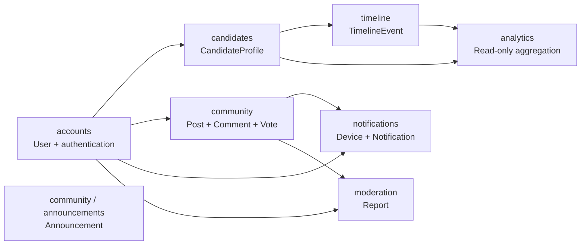

### Ownership rules

| Entity | Django app |
|---|---|
| User | `accounts` |
| CandidateProfile | `candidates` |
| TimelineEvent | `timeline` |
| Post | `community` |
| Comment | `community` |
| PostVote | `community` |
| Device | `notifications` |
| Notification | `notifications` |
| Report | `moderation` |
| Announcement | `community` or dedicated `announcements` app |

Keep analytics mostly read-only and calculated from authoritative candidate/timeline/community data.

---

# 3. Entity Relationship Diagram

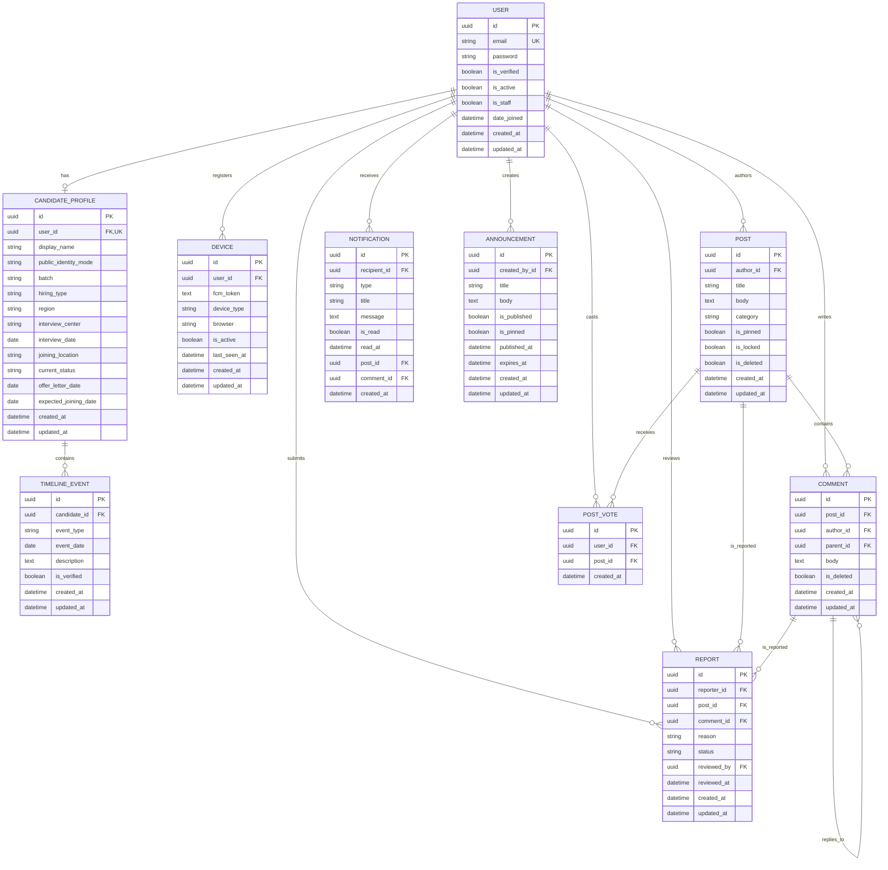

---

# 4. User Model

Use a custom Django user model from the beginning.

Recommended location:

```text
accounts/models.py
```

## Fields

| Field | Type | Constraints | Purpose |
|---|---|---|---|
| `id` | UUID | PK | Public-safe identifier |
| `email` | Email | Unique | Login identity |
| `password` | Django password hash | Required | Authentication |
| `is_verified` | Boolean | Default false | Email verification state |
| `is_active` | Boolean | Default true | Account status |
| `is_staff` | Boolean | Default false | Admin access |
| `date_joined` | DateTime | Auto | Registration time |
| `created_at` | DateTime | Auto | Creation timestamp |
| `updated_at` | DateTime | Auto | Modification timestamp |

Do not store plaintext passwords.

Use Django's password hashing system.

## Email uniqueness

Email addresses should be treated case-insensitively.

Recommended PostgreSQL/Django approach:

- Normalize email during registration.
- Store normalized email.
- Add a database uniqueness constraint.
- Consider PostgreSQL `CITEXT` if the project standardizes on it.

---

# 5. CandidateProfile

A user account and a candidate profile are different concepts.

Relationship:

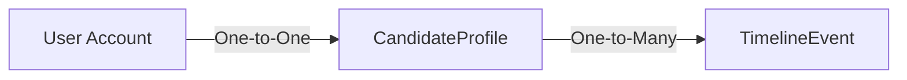

A candidate profile contains recruitment-related information while authentication remains in `User`.

## Fields

| Field | Type | Notes |
|---|---|---|
| `id` | UUID | PK |
| `user` | OneToOne(User) | Required |
| `display_name` | String | Optional/public display name |
| `public_identity_mode` | Choice | Anonymous or display name |
| `batch` | String | Example: `2025` |
| `hiring_type` | String/Choice | Prime/Digital/Ninja/etc. |
| `region` | String | Candidate region |
| `interview_center` | String | Interview location |
| `interview_date` | Date | Nullable |
| `joining_location` | String | Nullable |
| `current_status` | Choice | Current candidate state |
| `offer_letter_date` | Date | Nullable |
| `expected_joining_date` | Date | Nullable |
| `created_at` | DateTime | Auto |
| `updated_at` | DateTime | Auto |

Do not expose the user's email through public candidate APIs.

---

# 6. Candidate Status

Use a controlled set of status values instead of arbitrary strings.

Suggested initial values:

```text
REGISTERED
INTERVIEWED
SELECTED
OFFER_RECEIVED
READINESS_SURVEY
WAITING_FOR_JOINING_LETTER
JOINING_LETTER_RECEIVED
JOINING_DATE_RECEIVED
JOINED
OTHER
```

The exact labels can be changed later without changing the overall database architecture.

## Status transition model

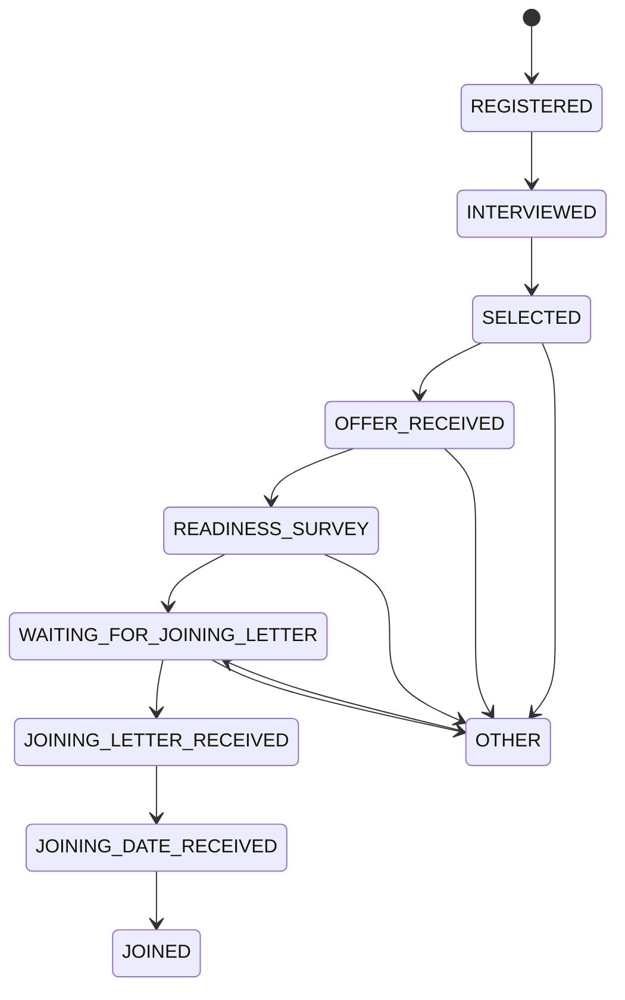

The application should validate transitions rather than trusting arbitrary client values.

---

# 7. TimelineEvent

Do not model the complete recruitment timeline as many fixed date columns.

Instead, use a separate event table.

This makes the timeline extensible.

## Fields

| Field | Type | Notes |
|---|---|---|
| `id` | UUID | PK |
| `candidate` | FK | CandidateProfile |
| `event_type` | Choice | Recruitment event |
| `event_date` | Date | Date event occurred |
| `description` | Text | Optional candidate note |
| `is_verified` | Boolean | Admin verification state |
| `created_at` | DateTime | Auto |
| `updated_at` | DateTime | Auto |

Suggested event types:

```text
INTERVIEW
SELECTION
OFFER_LETTER
READINESS_SURVEY
JOINING_LETTER
JOINING_DATE
JOINED
OTHER
```

## Timeline data flow

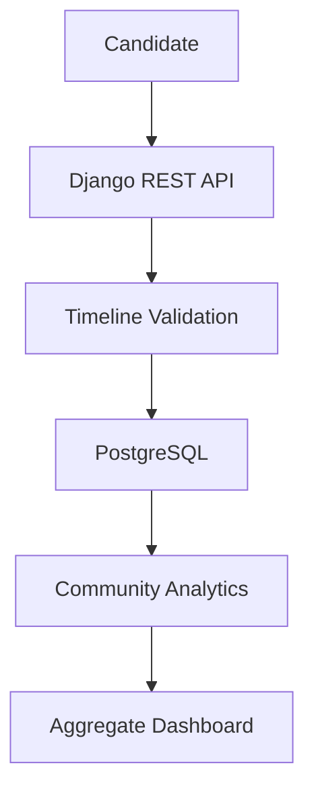

---

# 8. Device Model

FCM/browser tokens must not be stored directly on the User model.

One user can have:

- multiple browsers,
- multiple phones,
- multiple devices,
- multiple refreshed FCM tokens.

Therefore use a separate `Device` model.

## Fields

| Field | Type | Notes |
|---|---|---|
| `id` | UUID | PK |
| `user` | FK | Owner |
| `fcm_token` | Text | Device/browser token |
| `device_type` | Choice | Web/Android/iOS/other |
| `browser` | String | Optional |
| `is_active` | Boolean | Token state |
| `last_seen_at` | DateTime | Last registration/activity |
| `created_at` | DateTime | Auto |
| `updated_at` | DateTime | Auto |

FCM tokens are sensitive infrastructure identifiers. Never expose them through public APIs.

## Notification registration flow

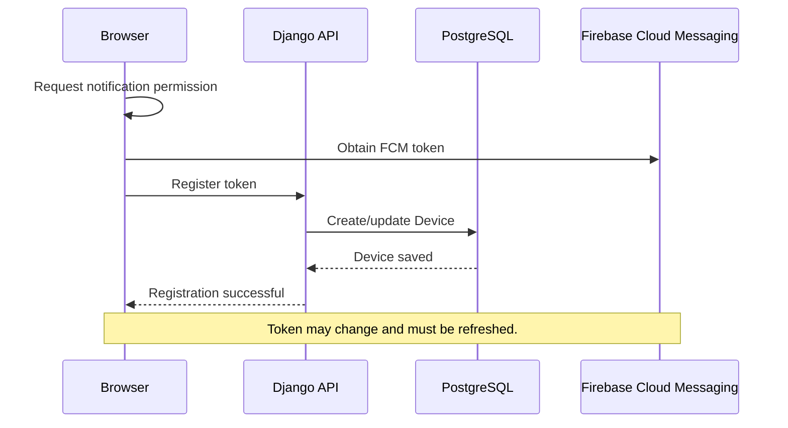

---

# 9. Post Model

Posts are the primary community content.

## Fields

| Field | Type | Notes |
|---|---|---|
| `id` | UUID | PK |
| `author` | FK(User) | Creator |
| `title` | String | Required |
| `body` | Text | Required |
| `category` | Choice/String | Community category |
| `is_pinned` | Boolean | Moderator control |
| `is_locked` | Boolean | Disable new comments |
| `is_deleted` | Boolean | Soft deletion |
| `created_at` | DateTime | Auto |
| `updated_at` | DateTime | Auto |

Suggested categories:

```text
JOINING_LETTER
JOINING_DATE
OFFER
INTERVIEW
TCS_PROCESS
GENERAL
DISCUSSION
HELP
ANNOUNCEMENT
OTHER
```

Do not store denormalized `vote_count` or `comment_count` initially.

Calculate them with database aggregation/querysets.

---

# 10. Comment Model

Comments belong to posts.

A self-referencing `parent` field enables one-level replies.

## Fields

| Field | Type | Notes |
|---|---|---|
| `id` | UUID | PK |
| `post` | FK(Post) | Required |
| `author` | FK(User) | Required |
| `parent` | FK(Comment) | Nullable |
| `body` | Text | Required |
| `is_deleted` | Boolean | Soft deletion |
| `created_at` | DateTime | Auto |
| `updated_at` | DateTime | Auto |

## Reply structure

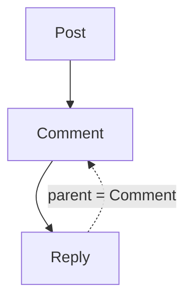

For MVP, enforce:

> A reply may target a top-level comment only.

Do not allow arbitrary comment nesting.

---

# 11. PostVote

Users can upvote a post.

## Fields

| Field | Type |
|---|---|
| `id` | UUID |
| `user` | FK(User) |
| `post` | FK(Post) |
| `created_at` | DateTime |

Required database constraint:

```text
UNIQUE(user, post)
```

This prevents duplicate votes.

## Vote flow

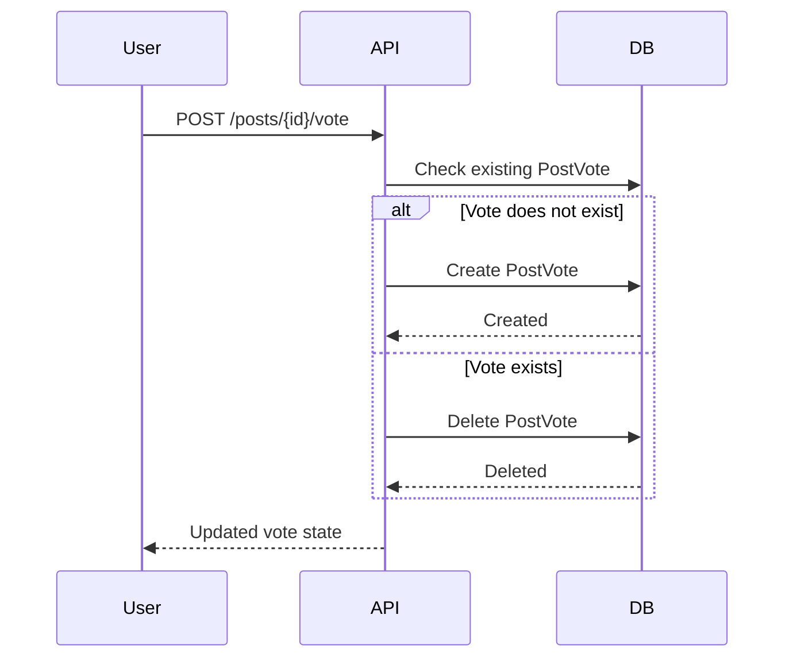

---

# 12. Notification Model

Notifications represent in-app events.

Examples:

- Comment on your post.
- Reply to your comment.
- Announcement published.
- Moderation action.
- Important system notification.

## Fields

| Field | Type | Notes |
|---|---|---|
| `id` | UUID | PK |
| `recipient` | FK(User) | Receiver |
| `type` | Choice | Notification category |
| `title` | String | Short title |
| `message` | Text | Body |
| `is_read` | Boolean | Read state |
| `read_at` | DateTime | Nullable |
| `post` | FK(Post) | Optional |
| `comment` | FK(Comment) | Optional |
| `created_at` | DateTime | Auto |

Prefer explicit nullable foreign keys for MVP rather than Django `GenericForeignKey`.

This makes querying and referential integrity easier.

---

# 13. Report Model

Users can report inappropriate posts/comments.

A report must target exactly one object.

## Fields

| Field | Type | Notes |
|---|---|---|
| `id` | UUID | PK |
| `reporter` | FK(User) | User submitting report |
| `post` | FK(Post) | Nullable |
| `comment` | FK(Comment) | Nullable |
| `reason` | Choice | Report reason |
| `status` | Choice | Pending/Reviewed/Resolved/Dismissed |
| `reviewed_by` | FK(User) | Nullable |
| `reviewed_at` | DateTime | Nullable |
| `created_at` | DateTime | Auto |
| `updated_at` | DateTime | Auto |

The application and database constraints should ensure exactly one of:

```text
post != NULL
comment != NULL
```

but not both.

Suggested report reasons:

```text
SPAM
HARASSMENT
MISINFORMATION
ABUSIVE_CONTENT
PERSONAL_INFORMATION
IMPERSONATION
OTHER
```

---

# 14. Announcement Model

Announcements are controlled by administrators.

## Fields

| Field | Type |
|---|---|
| `id` | UUID |
| `created_by` | FK(User) |
| `title` | String |
| `body` | Text |
| `is_published` | Boolean |
| `is_pinned` | Boolean |
| `published_at` | DateTime |
| `expires_at` | DateTime |
| `created_at` | DateTime |
| `updated_at` | DateTime |

Announcements must be clearly distinguishable from community-submitted posts.

---

# 15. Community Analytics

The application should calculate statistics from candidate profiles and timeline events.

Examples:

- Number of registered candidates.
- Candidates by hiring type.
- Candidates by batch.
- Candidates waiting for joining letters.
- Number of joining letters reported.
- Time between offer and joining letter.
- Community-reported joining locations.
- Timeline event distribution.

## Analytics flow

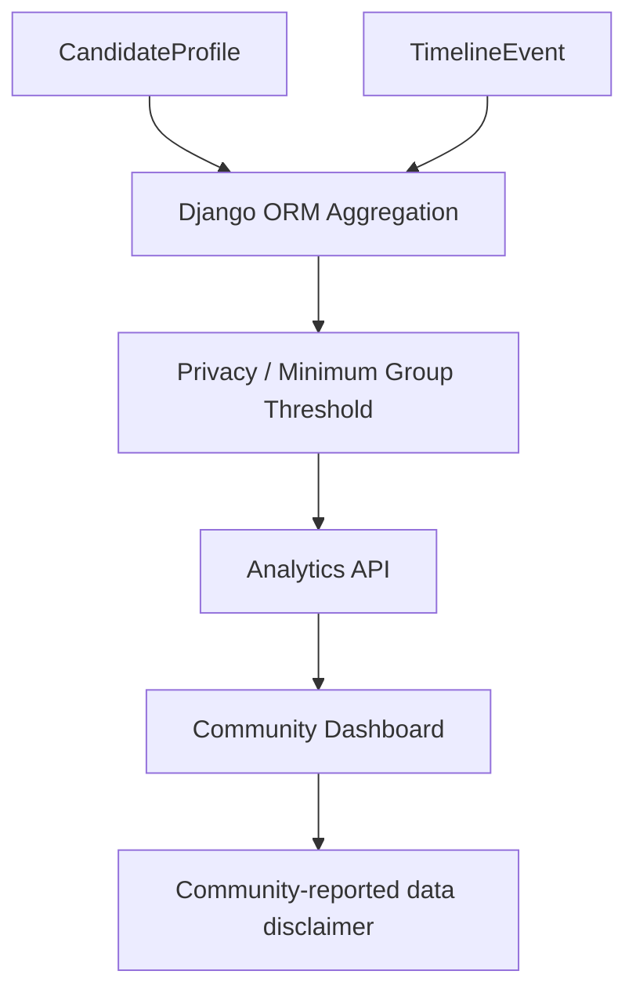

Analytics must never expose individual candidate records when aggregate data is sufficient.

---

# 16. Small-Group Privacy

Avoid showing statistics that could identify an individual candidate.

For example, if a filter produces only one candidate, do not display:

```text
1 candidate from [very specific combination]
```

Instead, return:

```text
Not enough community data to display this breakdown.
```

A configurable threshold can be used, for example:

```text
MIN_ANALYTICS_GROUP_SIZE = 5
```

The exact threshold can be adjusted later.

---

# 17. Indexing Strategy

Indexes should support common application queries.

## CandidateProfile

Recommended indexes:

```text
batch
hiring_type
region
current_status
joining_location
interview_date
offer_letter_date
expected_joining_date
```

Composite indexes should be added only after identifying real query patterns.

Potential examples:

```text
(batch, hiring_type)
(batch, current_status)
(hiring_type, current_status)
```

## TimelineEvent

Recommended:

```text
(candidate, event_date)
(event_type, event_date)
```

## Post

Recommended:

```text
(category, created_at)
(created_at)
(is_pinned, created_at)
```

## Comment

Recommended:

```text
(post, created_at)
(parent, created_at)
```

## Notification

Recommended:

```text
(recipient, is_read, created_at)
(recipient, created_at)
```

## Report

Recommended:

```text
(status, created_at)
(post, status)
(comment, status)
```

Do not blindly add indexes to every field.

Every index increases storage and write cost.

---

# 18. UUID Strategy

Use UUID primary keys for major user-facing entities.

Recommended:

```text
User
CandidateProfile
TimelineEvent
Device
Post
Comment
PostVote
Notification
Report
Announcement
```

Benefits:

- Avoid sequential public IDs.
- Reduce easy enumeration.
- Better separation between public identifiers and internal row order.
- Suitable for distributed systems if the project grows later.

UUIDs are not a substitute for authorization.

---

# 19. Foreign-Key Delete Strategy

Recommended behavior:

| Relationship | Delete behavior |
|---|---|
| User → CandidateProfile | CASCADE |
| CandidateProfile → TimelineEvent | CASCADE |
| User → Device | CASCADE |
| User → Post | Prefer SET_NULL or anonymization |
| Post → Comment | CASCADE |
| User → Comment | Prefer SET_NULL/anonymization |
| User → PostVote | CASCADE |
| User → Notification | CASCADE |
| User → Report | RESTRICT/SET_NULL depending on retention policy |
| Post → Report | SET_NULL |
| Comment → Report | SET_NULL |
| User → Announcement | SET_NULL/PROTECT |

The final choice should match the account-deletion policy.

---

# 20. Soft Deletion

Use soft deletion where community moderation history matters.

For `Post`:

```text
is_deleted = True
```

For `Comment`:

```text
is_deleted = True
```

The API should normally return a placeholder such as:

```text
This content has been removed.
```

rather than physically deleting moderation-relevant records.

---

# 21. Account Deletion

Account deletion should not automatically destroy useful community discussions if doing so would break conversation integrity.

Recommended flow:

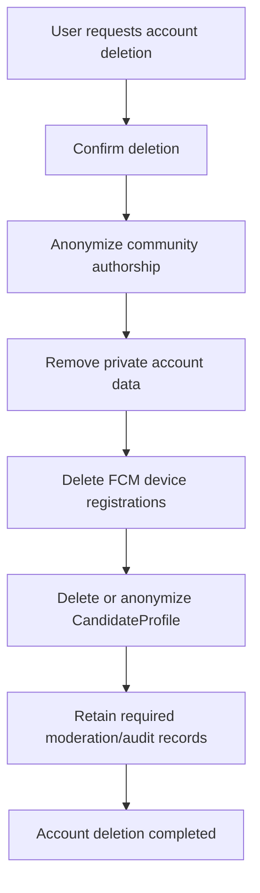

Do not promise complete immediate erasure of every historical record unless the retention architecture supports it.

---

# 22. Public Identity

Candidates should control how their community contributions appear.

Suggested values:

```text
ANONYMOUS
DISPLAY_NAME
```

Example:

```text
Anonymous Candidate
```

or:

```text
Sai
```

Public serializers must never accidentally expose:

- Email.
- Password hash.
- FCM token.
- IP address.
- Internal authentication fields.
- Private moderation metadata.

---

# 23. Sensitive Data

Treat the following as sensitive:

- Password hashes.
- Email addresses.
- FCM tokens.
- Password-reset tokens.
- Email-verification tokens.
- IP addresses.
- Authentication/session information.
- Internal moderation information.

Never return these from public endpoints.

---

# 24. Authentication Tokens

Do not store raw JWT access tokens in normal application tables.

If using DRF Simple JWT:

- Use short-lived access tokens.
- Use refresh-token rotation where appropriate.
- Configure token lifetime deliberately.
- Keep authentication secrets in environment variables/secrets management.
- Do not commit secrets to Git.

If refresh-token blacklisting is enabled, use the package's recommended token blacklist tables.

---

# 25. Timestamp Strategy

Use timezone-aware timestamps.

Recommended:

```python
USE_TZ = True
```

Use UTC in storage.

Typical fields:

```text
created_at
updated_at
published_at
reviewed_at
read_at
last_seen_at
```

Convert timestamps to the user's locale at the presentation layer.

---

# 26. Validation Rules

Validation should exist at multiple levels:

1. Serializer validation.
2. Django model validation where appropriate.
3. Database constraints for invariants that must never be violated.

Examples:

- One email per account.
- One candidate profile per user.
- One vote per user/post.
- Exactly one report target.
- Reply cannot have a reply as its parent.
- `read_at` should be set when a notification is marked read.
- `published_at` should exist when an announcement becomes published.
- Date relationships should be validated where logically required.

---

# 27. Candidate Timeline Validation

Example logical rules:

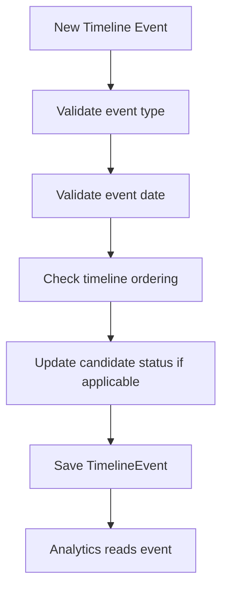

Do not blindly reject unusual real-world timelines if the candidate can legitimately receive events out of the expected order.

Prefer warnings or controlled validation over overly rigid assumptions.

---

# 28. Community Post Query Strategy

Typical feed query:

```text
Post
→ select_related(author)
→ filter(is_deleted=False)
→ order by pinned/created_at
→ paginate
```

Avoid:

```text
for post in posts:
    post.author
    post.comments.count()
    post.votes.count()
```

without optimization.

Use:

- `select_related()`
- `prefetch_related()`
- `annotate()`
- database aggregation

to avoid N+1 queries.

---

# 29. Vote Counting

For MVP, calculate votes using database aggregation.

Example conceptual query:

```python
Post.objects.filter(
    is_deleted=False
).annotate(
    vote_count=Count("votes")
)
```

Do not introduce Redis counters or denormalized vote fields unless actual scale requires them.

---

# 30. Comment Counting

Similarly:

```python
Post.objects.filter(
    is_deleted=False
).annotate(
    comment_count=Count("comments")
)
```

Use database aggregation first.

---

# 31. Pagination

All potentially large list endpoints must be paginated.

Examples:

```text
/community/posts
/community/posts/{id}/comments
/notifications
/timeline
```

Recommended DRF pagination:

```text
PageNumberPagination
```

or cursor pagination for feeds if needed later.

Default page size can begin around:

```text
20
```

and be adjusted after observing usage.

---

# 32. Search

MVP search can use PostgreSQL queries.

Search targets:

- Post title.
- Post body.
- Candidate community-safe fields where appropriate.

Do not introduce Elasticsearch/OpenSearch in the MVP.

If search requirements grow substantially, PostgreSQL full-text search can be evaluated before adding another infrastructure dependency.

---

# 33. Attachments

If attachments are introduced:

Do not store large binary files directly in PostgreSQL.

Recommended architecture:

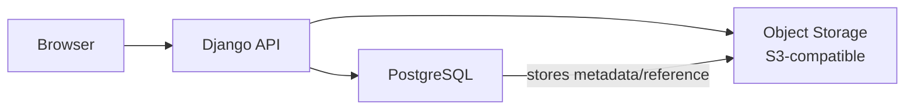

Database should store metadata such as:

```text
file name
content type
size
storage key
uploaded_by
created_at
```

The MVP can initially omit attachments.

---

# 34. Transactions

Use `transaction.atomic()` when multiple database operations must succeed or fail together.

Examples:

### Creating a candidate profile and initial timeline event

```text
BEGIN
    create CandidateProfile
    create initial TimelineEvent
COMMIT
```

### Creating a report

```text
BEGIN
    create Report
    optionally create moderation Notification
COMMIT
```

### Account deletion

Use an atomic transaction for database changes that must remain consistent.

Do not hold long-running transactions around external network calls.

---

# 35. Redis Boundary

Redis should not become the authoritative source of candidate data.

Recommended separation:

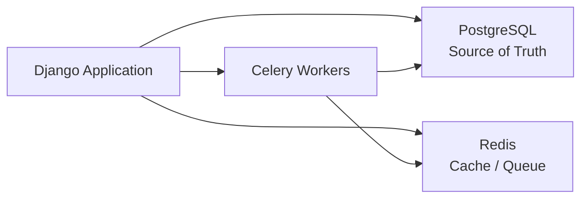

Use Redis for:

- Caching.
- Celery broker/result backend where configured.
- Rate limiting if implemented.
- Temporary data.

Do not store the authoritative candidate timeline only in Redis.

---

# 36. Notifications and Celery

For asynchronous notifications:

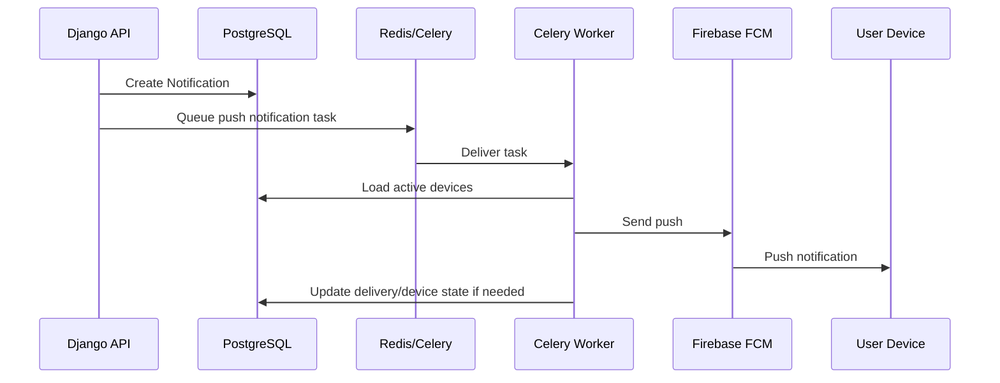

A failed push must not corrupt the primary database transaction.

---

# 37. Moderation Flow

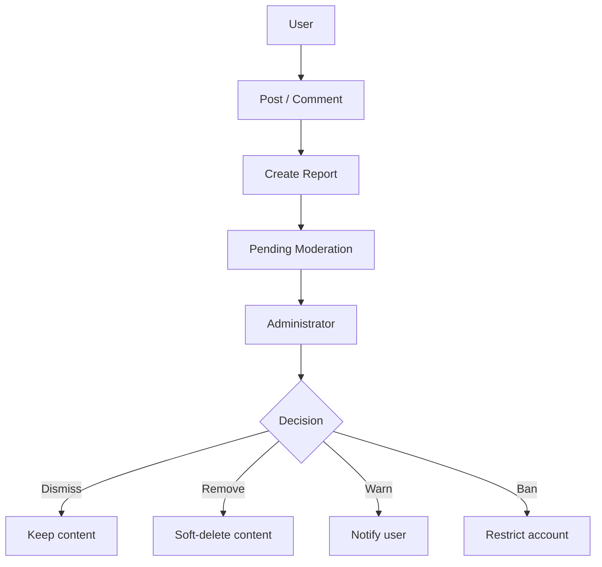

Moderation actions should be auditable.

---

# 38. Constraints

Recommended database-level constraints include:

### User

```text
email UNIQUE
```

### CandidateProfile

```text
user UNIQUE
```

### PostVote

```text
UNIQUE(user, post)
```

### Report

Exactly one target:

```text
(post IS NOT NULL) XOR (comment IS NOT NULL)
```

### Comment

For MVP, application validation should prevent:

```text
parent.parent IS NOT NULL
```

meaning no nested replies beyond one level.

---

# 39. Data Integrity Rules

The database should never become dependent on frontend validation.

Frontend validation improves UX.

Backend validation protects correctness.

Database constraints protect invariants.

The rule is:

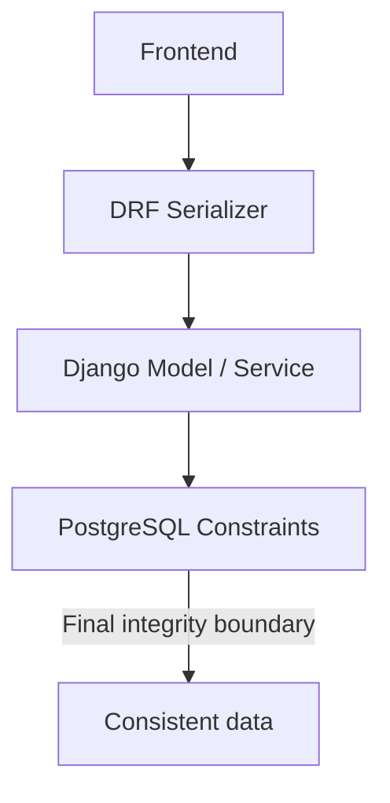

---

# 40. API Serializer Exposure Rules

Create separate serializers where necessary.

Do not reuse a private serializer as a public serializer.

Example:

```text
UserPrivateSerializer
UserPublicSerializer

CandidatePrivateSerializer
CandidatePublicSerializer

PostSerializer
AdminPostSerializer
```

Public serializers should expose only the fields required by the UI.

---

# 41. Analytics Data Rules

Community analytics must be labeled clearly.

Example:

```text
Community-reported data
```

Do not use language such as:

```text
Official TCS statistics
```

unless the information has an explicitly verified official source.

Analytics should distinguish:

```text
Reported by candidates
Verified by administrators
Officially sourced information
```

These categories should never be silently mixed.

---

# 42. Audit Logging

MVP can rely on Django Admin history and moderation fields.

If moderation becomes significant, introduce an explicit audit model later:

```text
AuditLog
- actor
- action
- entity_type
- entity_id
- metadata
- created_at
```

Do not add a complex audit framework unless there is an actual requirement.

---

# 43. Backups

Production PostgreSQL should have:

- Automated backups.
- Point-in-time recovery where supported.
- Monitoring.
- Restore testing.

A backup that has never been restored/tested should not be treated as a proven recovery mechanism.

---

# 44. Migration Rules

Every schema change must use Django migrations.

Workflow:

```text
Modify model
    ↓
python manage.py makemigrations
    ↓
Review migration
    ↓
python manage.py migrate
    ↓
Run tests
```

Never manually modify production tables without documenting the corresponding migration strategy.

---

# 45. Seed Data

Development seed data should include:

- Admin user.
- Test candidate.
- Multiple candidate statuses.
- Timeline events.
- Community posts.
- Comments.
- Replies.
- Votes.
- Notifications.
- Reports.
- Announcement.

Seed data must never contain real candidate personal information.

---

# 46. Testing Database Behavior

Minimum database tests:

### User

- Unique email.
- Email normalization.
- Password hashing.

### CandidateProfile

- One profile per user.
- Status validation.
- Public identity behavior.

### TimelineEvent

- Correct candidate relationship.
- Event type validation.
- Timeline ordering behavior.

### Post

- Soft deletion.
- Categories.
- Author relationship.

### Comment

- Top-level comments.
- One-level replies.
- Soft deletion.

### PostVote

- Duplicate vote prevented.
- Vote removal works.

### Device

- Token registration/update.
- Inactive token handling.

### Notification

- Read/unread state.
- Recipient isolation.

### Report

- Exactly one target.
- Status changes.
- Moderator assignment.

---

# 47. Performance Guidelines

For the expected MVP scale, PostgreSQL should be sufficient.

Initial target:

```text
~2,000 registered users
~500 daily active users
~20 concurrent users
```

Priorities:

1. Correct queries.
2. Proper indexes.
3. Pagination.
4. Avoid N+1 queries.
5. Connection pooling.
6. Redis caching only where useful.
7. Background processing for slow work.

Do not prematurely introduce:

- Microservices.
- Elasticsearch.
- Kafka.
- Kubernetes.
- Distributed databases.
- Complex event-sourcing architecture.

---

# 48. Recommended Initial Schema Summary

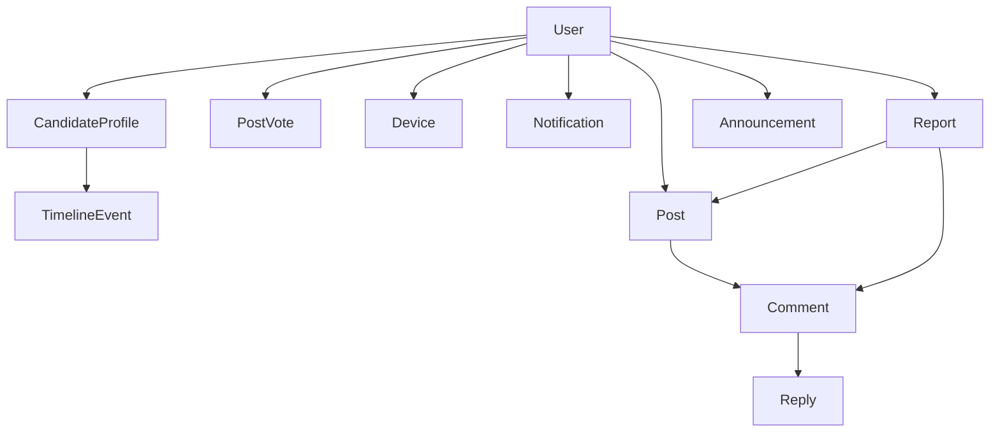

Core authoritative entities:

```text
User
CandidateProfile
TimelineEvent
Post
Comment
PostVote
Device
Notification
Report
Announcement
```

---

# 49. MVP Database Definition of Done

The database is considered complete when:

- [ ] Custom Django User model exists.
- [ ] PostgreSQL is configured.
- [ ] UUID identifiers are implemented for major entities.
- [ ] CandidateProfile exists as a OneToOne relationship.
- [ ] TimelineEvent exists as a separate model.
- [ ] Candidate status choices are controlled.
- [ ] Device model supports multiple FCM/browser devices.
- [ ] Post model exists.
- [ ] Comment model supports one-level replies.
- [ ] PostVote has a unique user/post constraint.
- [ ] Notification model exists.
- [ ] Report model enforces one target.
- [ ] Announcement model exists.
- [ ] Soft deletion is implemented for community content.
- [ ] Required indexes are created.
- [ ] Public/private serializer boundaries are defined.
- [ ] Sensitive fields are never publicly exposed.
- [ ] Analytics can be calculated from authoritative records.
- [ ] Small-group analytics privacy is implemented.
- [ ] Migrations are committed.
- [ ] Database tests cover integrity constraints.
- [ ] Seed data contains no real personal information.
- [ ] Backup strategy is defined for production.

---

# 50. AI Agent Implementation Rules

When an AI coding agent implements this database:

1. Read this document before creating models.
2. Do not invent additional core entities without a documented requirement.
3. Use Django ORM.
4. Use a custom User model from the start.
5. Use UUID primary keys for major entities.
6. Use PostgreSQL.
7. Use timezone-aware timestamps.
8. Add database constraints for important invariants.
9. Do not expose private user data through serializers.
10. Never store plaintext passwords.
11. Never store FCM tokens in public response payloads.
12. Use a separate Device model for notification tokens.
13. Keep TimelineEvent separate from CandidateProfile.
14. Do not introduce GenericForeignKey unless a concrete requirement justifies it.
15. Do not introduce Redis as the source of truth.
16. Do not introduce Elasticsearch for MVP.
17. Do not add chat models until chat is explicitly in scope.
18. Do not add payment models until payments are explicitly in scope.
19. Use migrations for all schema changes.
20. Write model and constraint tests.
21. Avoid N+1 queries.
22. Use `select_related` and `prefetch_related` appropriately.
23. Paginate list APIs.
24. Use transactions for multi-write operations.
25. Do not perform external network calls inside long database transactions.
26. Keep analytics aggregate-only.
27. Apply minimum-group privacy rules.
28. Preserve moderation history where appropriate.
29. Treat community-reported information as community data, not official TCS data.
30. Prefer simple relational architecture until actual scale requires more complexity.

---

# 51. Relationship to Other Project Documents

This document should be implemented together with:

```text
01_PRODUCT_REQUIREMENTS.md
02_USER_FLOWS.md
04_API_SPECIFICATION.md
05_UI_UX_SPECIFICATION.md
06_AUTH_SECURITY.md
07_NOTIFICATION_SYSTEM.md
08_MODERATION.md
09_PROJECT_ARCHITECTURE.md
10_MVP_TASKS.md
11_AI_AGENT_RULES.md
12_SEED_DATA.md
```

The database design is the authoritative source for the MVP's persistent data model.

When another document proposes a new persistent entity, the AI agent should verify that it is required before modifying this schema.
