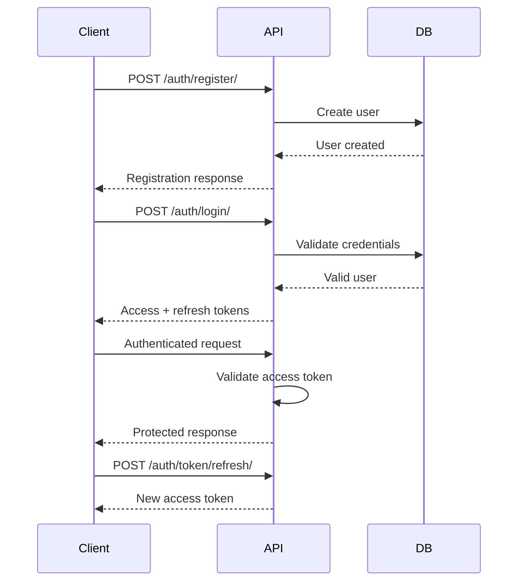
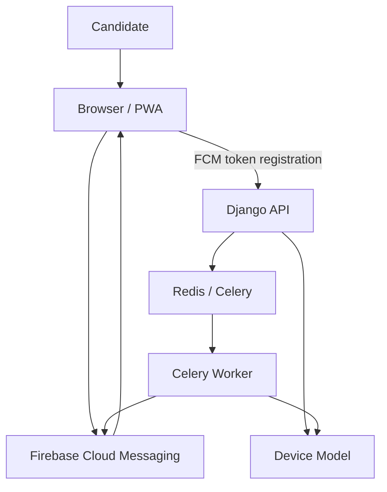
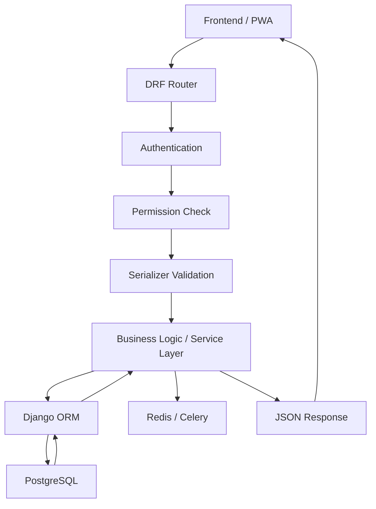
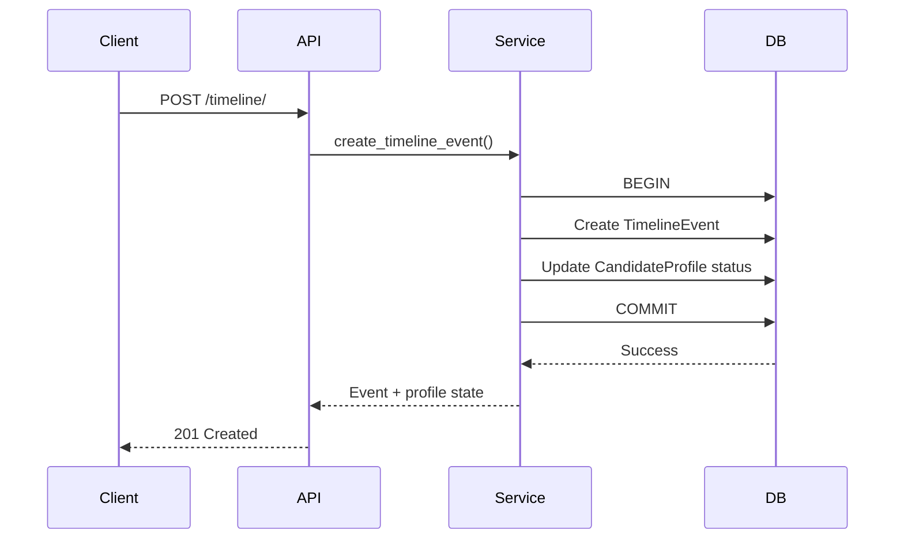
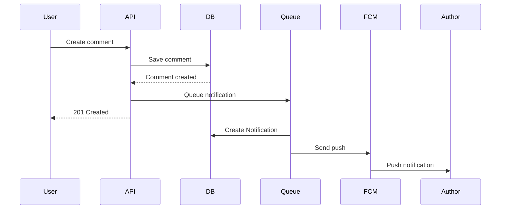
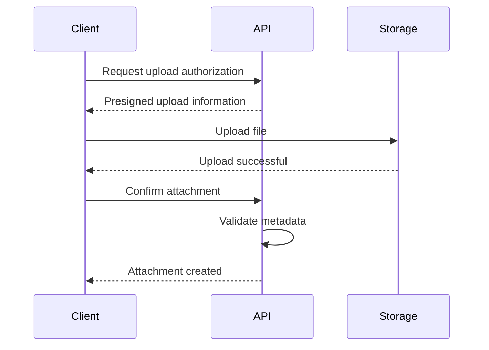
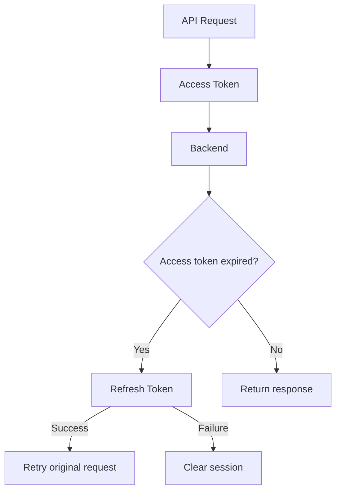
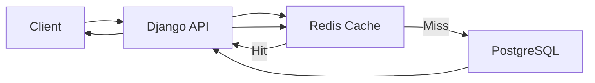
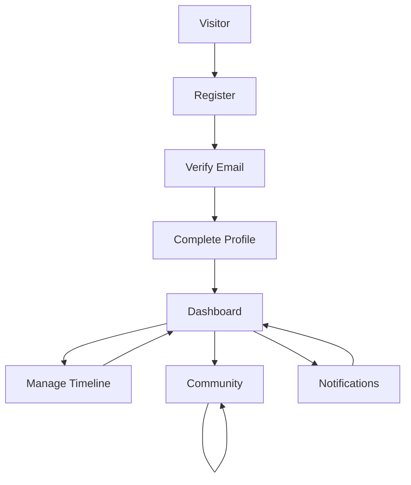

# 04 — API Specification

# TCS Joining Tracker — REST API Specification

> **Purpose:** Define the complete backend API contract for the TCS Joining Tracker MVP.
>
> **Implementation target:** Django + Django REST Framework + PostgreSQL + Redis/Celery where asynchronous processing is required.
>
> **API style:** RESTful JSON API.
>
> **Important product boundary:** TCS Joining Tracker is an independent community platform. API responses containing candidate timelines, joining information, statistics, or announcements must not imply that the platform is operated, endorsed, or verified by Tata Consultancy Services (TCS).

---

# 1. API Goals

The API must provide secure and predictable endpoints for:

- Authentication.
- Account verification.
- Password reset.
- Candidate profile management.
- Candidate recruitment timeline management.
- Dashboard data.
- Community posts.
- Comments and one-level replies.
- Post voting.
- Community search and filtering.
- Community-reported analytics.
- In-app notifications.
- Browser/device FCM registration.
- Reports and moderation.
- Announcements.
- Account/privacy settings.
- Health/status checks where required.
- Administrative operations through Django Admin and/or protected admin APIs where explicitly needed.

The API must be designed so the frontend can be replaced without changing the underlying business rules.

---

# 2. API Principles

The implementation must follow these principles:

1. JSON request/response bodies.
2. Consistent HTTP status codes.
3. Consistent error format.
4. Authentication through secure token/session mechanisms.
5. Authorization enforced server-side.
6. Object-level permissions.
7. Pagination for potentially large collections.
8. Filtering through explicit query parameters.
9. No sensitive fields in public serializers.
10. No business-rule enforcement in the frontend only.
11. Database constraints remain the final integrity boundary.
12. APIs should be versioned.
13. API contracts should remain backward-compatible where practical.
14. Avoid unnecessary endpoints.
15. Do not expose internal database implementation details.
16. Do not expose FCM tokens.
17. Do not expose user email addresses publicly.
18. Do not expose moderation metadata to ordinary users.
19. Analytics must remain aggregate and privacy-preserving.
20. Community-reported data must be labeled as such.

---

# 3. Base URL

Recommended production structure:

```text
https://api.example.com/api/v1/
```

Example:

```text
GET https://api.example.com/api/v1/posts/
```

Development:

```text
http://localhost:8000/api/v1/
```

The actual production domain must be configured through environment variables.

Example:

```env
API_BASE_URL=https://api.example.com
API_VERSION=v1
```

Do not hard-code the production domain in application code.

---

# 4. Versioning

Use URL versioning:

```text
/api/v1/
```

Example:

```text
/api/v1/auth/login/
/api/v1/profile/
/api/v1/posts/
```

If a future breaking API contract is required:

```text
/api/v2/
```

Do not silently introduce breaking changes under `/v1/`.

---

# 5. Authentication Strategy

Recommended MVP:

```text
Django REST Framework
+
Simple JWT
```

Typical flow:



Recommended access token lifetime:

```text
Short-lived
```

Recommended refresh token strategy:

```text
Refresh token rotation where appropriate
```

Exact lifetimes must be configured through environment/settings rather than hard-coded in frontend code.

---

# 6. Authorization Levels

The API has several authorization levels.

## Anonymous

Can access:

- Landing-page information.
- Public/community feed where configured.
- Public posts.
- Public comments.
- Public aggregate statistics.
- Login/register/password-reset endpoints.

Cannot:

- Modify candidate profile.
- Create posts if authentication is required.
- Vote.
- Comment.
- Manage notifications.
- Report content if reporting requires authentication.

## Authenticated Candidate

Can:

- Read/update own profile.
- Manage own timeline.
- Create posts.
- Edit/delete own posts according to rules.
- Comment.
- Reply.
- Vote.
- Report content.
- Read own notifications.
- Register own devices.
- Delete own account.

Cannot:

- Access another user's private profile data.
- Modify another user's timeline.
- Moderate arbitrary content.
- Access admin endpoints.

## Administrator

Can:

- Moderate reports.
- Manage users.
- Manage announcements.
- Pin/lock/remove content.
- Review candidate-submitted data where moderation permissions allow.
- View protected moderation information.

Use Django's permission system rather than checking `is_staff` everywhere.

---

# 7. Common HTTP Status Codes

| Status | Meaning |
|---|---|
| `200 OK` | Successful request |
| `201 Created` | Resource created |
| `202 Accepted` | Request accepted for asynchronous processing |
| `204 No Content` | Successful request with no response body |
| `400 Bad Request` | Invalid request |
| `401 Unauthorized` | Authentication required/invalid |
| `403 Forbidden` | Authenticated but not permitted |
| `404 Not Found` | Resource does not exist or is intentionally hidden |
| `405 Method Not Allowed` | HTTP method unsupported |
| `409 Conflict` | Resource/state conflict |
| `413 Payload Too Large` | Request/file too large |
| `415 Unsupported Media Type` | Unsupported content type |
| `422 Unprocessable Entity` | Optional semantic validation response |
| `429 Too Many Requests` | Rate limit exceeded |
| `500 Internal Server Error` | Unexpected server error |
| `503 Service Unavailable` | Service temporarily unavailable |

For consistency, use `400` for most DRF validation failures unless there is a strong reason to use another semantic status.

---

# 8. Standard Response Format

The API may use resource-specific response objects, but collection and error formats should be consistent.

## Success example

```json
{
  "id": "9a9f8d8b-7c1a-4e15-a1a8-111111111111",
  "title": "Any updates on joining letters?",
  "category": "JOINING_LETTER"
}
```

Do not wrap every single object unnecessarily:

```json
{
  "data": {
    "..."
  }
}
```

unless the project deliberately adopts that convention.

---

# 9. Pagination Format

Recommended DRF page-number pagination:

```json
{
  "count": 125,
  "next": "https://api.example.com/api/v1/posts/?page=2",
  "previous": null,
  "results": [
    {}
  ]
}
```

Default page size:

```text
20
```

Allow a controlled maximum:

```text
50
```

Do not allow arbitrary client-supplied page sizes such as:

```text
?page_size=100000
```

---

# 10. Standard Error Format

Recommended:

```json
{
  "error": {
    "code": "VALIDATION_ERROR",
    "message": "The request contains invalid fields.",
    "details": {
      "email": [
        "Enter a valid email address."
      ]
    }
  }
}
```

Authentication error:

```json
{
  "error": {
    "code": "AUTHENTICATION_REQUIRED",
    "message": "Authentication credentials were not provided."
  }
}
```

Permission error:

```json
{
  "error": {
    "code": "PERMISSION_DENIED",
    "message": "You do not have permission to perform this action."
  }
}
```

Not found:

```json
{
  "error": {
    "code": "NOT_FOUND",
    "message": "The requested resource was not found."
  }
}
```

Rate limit:

```json
{
  "error": {
    "code": "RATE_LIMITED",
    "message": "Too many requests. Please try again later."
  }
}
```

Do not return stack traces in production.

---

# 11. Common Headers

Client requests:

```http
Content-Type: application/json
Accept: application/json
Authorization: Bearer <access_token>
```

For authenticated requests:

```http
Authorization: Bearer <access_token>
```

Do not log full Authorization headers.

---

# 12. Authentication API

Base:

```text
/api/v1/auth/
```

---

## 12.1 Register

```http
POST /api/v1/auth/register/
```

### Request

```json
{
  "email": "candidate@example.com",
  "password": "StrongPassword123!",
  "password_confirm": "StrongPassword123!"
}
```

### Response

```http
201 Created
```

```json
{
  "message": "Registration successful. Please verify your email.",
  "user": {
    "id": "uuid",
    "email": "candidate@example.com",
    "is_verified": false
  }
}
```

The API should send an email verification message asynchronously.

### Validation

- Valid email.
- Email uniqueness.
- Password strength.
- Password confirmation.
- Account must not already exist.
- Rate limit registration attempts.

Do not return password data.

---

# 13. Email Verification

## 13.1 Request Verification Email

```http
POST /api/v1/auth/verification/resend/
```

### Request

```json
{
  "email": "candidate@example.com"
}
```

The endpoint should avoid revealing whether an account exists.

Recommended response:

```json
{
  "message": "If the account exists, a verification email has been sent."
}
```

This helps prevent account enumeration.

---

## 13.2 Verify Email

Two implementation options are acceptable:

### Option A — Token API

```http
POST /api/v1/auth/verification/verify/
```

```json
{
  "token": "verification-token"
}
```

### Response

```json
{
  "message": "Email verified successfully."
}
```

### Option B — Browser Verification Link

```text
GET /verify-email/<token>/
```

The frontend can consume the verification state.

The exact mechanism must remain consistent between frontend and backend.

---

# 14. Login

```http
POST /api/v1/auth/login/
```

### Request

```json
{
  "email": "candidate@example.com",
  "password": "StrongPassword123!"
}
```

### Successful response

```json
{
  "access": "jwt-access-token",
  "refresh": "jwt-refresh-token",
  "user": {
    "id": "uuid",
    "email": "candidate@example.com",
    "is_verified": true
  }
}
```

Do not return sensitive account fields.

### Invalid credentials

Use a generic message:

```json
{
  "error": {
    "code": "INVALID_CREDENTIALS",
    "message": "Invalid email or password."
  }
}
```

Do not reveal whether the email exists.

---

# 15. Token Refresh

```http
POST /api/v1/auth/token/refresh/
```

### Request

```json
{
  "refresh": "jwt-refresh-token"
}
```

### Response

```json
{
  "access": "new-access-token"
}
```

If refresh rotation is enabled, follow Simple JWT's configured behavior.

---

# 16. Logout

For stateless JWT authentication, logout can be implemented by:

- Client deleting tokens.
- Refresh-token blacklisting if enabled.

Recommended endpoint:

```http
POST /api/v1/auth/logout/
```

### Request

```json
{
  "refresh": "jwt-refresh-token"
}
```

### Response

```http
204 No Content
```

If server-side refresh blacklisting is not enabled, the endpoint should still return a safe success response after the client clears credentials.

---

# 17. Password Reset

## 17.1 Request Password Reset

```http
POST /api/v1/auth/password-reset/request/
```

### Request

```json
{
  "email": "candidate@example.com"
}
```

Response:

```json
{
  "message": "If the account exists, password reset instructions have been sent."
}
```

Do not reveal whether the email exists.

---

## 17.2 Confirm Password Reset

```http
POST /api/v1/auth/password-reset/confirm/
```

### Request

```json
{
  "token": "reset-token",
  "new_password": "NewStrongPassword123!",
  "new_password_confirm": "NewStrongPassword123!"
}
```

### Response

```json
{
  "message": "Password reset successfully."
}
```

Reset tokens must:

- Expire.
- Be single-use.
- Be securely generated.
- Never be stored in plaintext if the implementation supports hashed token storage.

---

# 18. Current User

```http
GET /api/v1/me/
```

Authentication required.

### Response

```json
{
  "id": "uuid",
  "email": "candidate@example.com",
  "is_verified": true,
  "profile_completed": true,
  "created_at": "2026-09-19T12:00:00Z"
}
```

This endpoint must not return:

- Password hash.
- FCM tokens.
- Internal moderation data.
- IP addresses.
- Reset tokens.
- Verification tokens.

---

# 19. Candidate Profile API

Base:

```text
/api/v1/profile/
```

---

## 19.1 Get My Profile

```http
GET /api/v1/profile/
```

### Response

```json
{
  "id": "uuid",
  "display_name": "Sai",
  "public_identity_mode": "DISPLAY_NAME",
  "batch": "2025",
  "hiring_type": "DIGITAL",
  "region": "Telangana",
  "interview_center": "Hyderabad",
  "interview_date": "2026-04-23",
  "joining_location": "Hyderabad",
  "current_status": "WAITING_FOR_JOINING_LETTER",
  "offer_letter_date": "2026-05-05",
  "expected_joining_date": null,
  "created_at": "2026-09-19T12:00:00Z",
  "updated_at": "2026-09-19T12:00:00Z"
}
```

---

# 20. Create Candidate Profile

```http
POST /api/v1/profile/
```

### Request

```json
{
  "display_name": "Sai",
  "public_identity_mode": "DISPLAY_NAME",
  "batch": "2025",
  "hiring_type": "DIGITAL",
  "region": "Telangana",
  "interview_center": "Hyderabad",
  "interview_date": "2026-04-23",
  "joining_location": "Hyderabad",
  "current_status": "WAITING_FOR_JOINING_LETTER",
  "offer_letter_date": "2026-05-05",
  "expected_joining_date": null
}
```

### Response

```http
201 Created
```

The backend must validate that the authenticated user does not already have a profile.

---

# 21. Update Candidate Profile

```http
PATCH /api/v1/profile/
```

Example:

```json
{
  "current_status": "JOINING_LETTER_RECEIVED",
  "joining_location": "Bangalore"
}
```

### Response

```json
{
  "id": "uuid",
  "current_status": "JOINING_LETTER_RECEIVED",
  "joining_location": "Bangalore"
}
```

Only fields permitted for candidate self-editing may be changed.

---

# 22. Delete Candidate Profile

Account deletion should generally be handled by the account endpoint rather than allowing arbitrary profile destruction.

Therefore:

```http
DELETE /api/v1/profile/
```

should either:

- be disallowed, or
- remove only the candidate profile while preserving account data according to explicit product rules.

Preferred MVP:

```text
Use DELETE /api/v1/account/
```

for complete account deletion.

---

# 23. Public Candidate Profile

The application should avoid exposing complete candidate profiles.

If a public profile endpoint is required:

```http
GET /api/v1/candidates/{id}/
```

Only return community-safe information.

Example:

```json
{
  "id": "uuid",
  "display_name": "Anonymous Candidate",
  "batch": "2025",
  "hiring_type": "DIGITAL",
  "region": "Telangana",
  "current_status": "WAITING_FOR_JOINING_LETTER"
}
```

Do not expose:

```text
email
phone
FCM token
password
private notes
internal moderation state
```

---

# 24. Timeline API

Base:

```text
/api/v1/timeline/
```

---

## 24.1 List My Timeline

```http
GET /api/v1/timeline/
```

### Response

```json
{
  "count": 4,
  "next": null,
  "previous": null,
  "results": [
    {
      "id": "uuid",
      "event_type": "INTERVIEW",
      "event_date": "2026-04-23",
      "description": "Interview completed.",
      "is_verified": false,
      "created_at": "2026-09-19T12:00:00Z"
    },
    {
      "id": "uuid",
      "event_type": "OFFER_LETTER",
      "event_date": "2026-05-05",
      "description": "Offer letter received.",
      "is_verified": false,
      "created_at": "2026-09-19T12:00:00Z"
    }
  ]
}
```

---

# 25. Create Timeline Event

```http
POST /api/v1/timeline/
```

### Request

```json
{
  "event_type": "JOINING_LETTER",
  "event_date": "2026-09-18",
  "description": "Joining letter received."
}
```

### Response

```http
201 Created
```

```json
{
  "id": "uuid",
  "event_type": "JOINING_LETTER",
  "event_date": "2026-09-18",
  "description": "Joining letter received.",
  "is_verified": false
}
```

The server should update `CandidateProfile.current_status` when appropriate.

This update should be handled in a service layer or transactional operation.

---

# 26. Update Timeline Event

```http
PATCH /api/v1/timeline/{event_id}/
```

Example:

```json
{
  "event_date": "2026-09-19",
  "description": "Updated information."
}
```

Users may edit only their own events.

---

# 27. Delete Timeline Event

```http
DELETE /api/v1/timeline/{event_id}/
```

Response:

```http
204 No Content
```

Do not allow deletion of an event that belongs to another candidate.

---

# 28. Dashboard API

```http
GET /api/v1/dashboard/
```

The dashboard endpoint should provide the information needed for the main authenticated dashboard.

Example:

```json
{
  "profile": {
    "completion_percentage": 90,
    "current_status": "WAITING_FOR_JOINING_LETTER"
  },
  "timeline": {
    "latest_event": {
      "event_type": "READINESS_SURVEY",
      "event_date": "2026-05-15"
    }
  },
  "community": {
    "unread_notifications": 3
  },
  "analytics": {
    "community_waiting_count": 412
  }
}
```

Analytics must be labeled as community-reported.

---

# 29. Community API

Base:

```text
/api/v1/posts/
```

---

# 30. List Posts

```http
GET /api/v1/posts/
```

Optional query parameters:

```text
?page=1
&category=JOINING_LETTER
&search=joining
&ordering=-created_at
```

Example:

```http
GET /api/v1/posts/?category=JOINING_LETTER&ordering=-created_at
```

### Response

```json
{
  "count": 125,
  "next": "https://api.example.com/api/v1/posts/?page=2",
  "previous": null,
  "results": [
    {
      "id": "uuid",
      "title": "Any joining letter updates?",
      "body_preview": "Has anyone from the 2025 batch...",
      "category": "JOINING_LETTER",
      "author": {
        "id": "uuid",
        "display_name": "Anonymous Candidate"
      },
      "vote_count": 18,
      "comment_count": 7,
      "is_pinned": false,
      "is_locked": false,
      "created_at": "2026-09-19T12:00:00Z"
    }
  ]
}
```

---

# 31. Post Ordering

Supported ordering:

```text
-created_at
created_at
-vote_count
vote_count
```

If pinned posts should always appear first, implement that server-side rather than trusting the client.

Do not allow arbitrary database field ordering.

---

# 32. Search Posts

```http
GET /api/v1/posts/?search=joining%20letter
```

Search should initially target:

```text
title
body
```

Use PostgreSQL search capabilities.

Do not introduce Elasticsearch for MVP.

---

# 33. Create Post

```http
POST /api/v1/posts/
```

Authentication required.

### Request

```json
{
  "title": "Any joining letter updates for 2025 Digital?",
  "body": "Has anyone received a joining letter recently?",
  "category": "JOINING_LETTER"
}
```

### Response

```http
201 Created
```

```json
{
  "id": "uuid",
  "title": "Any joining letter updates for 2025 Digital?",
  "body": "Has anyone received a joining letter recently?",
  "category": "JOINING_LETTER",
  "author": {
    "id": "uuid",
    "display_name": "Anonymous Candidate"
  },
  "vote_count": 0,
  "comment_count": 0,
  "is_pinned": false,
  "is_locked": false,
  "created_at": "2026-09-19T12:00:00Z"
}
```

---

# 34. Get Post

```http
GET /api/v1/posts/{post_id}/
```

Response:

```json
{
  "id": "uuid",
  "title": "Any joining letter updates?",
  "body": "Has anyone received a joining letter recently?",
  "category": "JOINING_LETTER",
  "author": {
    "id": "uuid",
    "display_name": "Anonymous Candidate"
  },
  "vote_count": 18,
  "comment_count": 7,
  "is_pinned": false,
  "is_locked": false,
  "is_deleted": false,
  "created_at": "2026-09-19T12:00:00Z",
  "updated_at": "2026-09-19T12:00:00Z"
}
```

Never expose internal moderation fields through the normal public serializer.

---

# 35. Update Post

```http
PATCH /api/v1/posts/{post_id}/
```

Only the author or authorized moderator can update.

Example:

```json
{
  "title": "Updated joining letter question",
  "body": "Updated information..."
}
```

The API must verify ownership.

---

# 36. Delete Post

```http
DELETE /api/v1/posts/{post_id}/
```

Preferred behavior:

```text
Soft delete
```

Response:

```http
204 No Content
```

The record may remain for moderation/audit integrity.

---

# 37. Lock Post

Moderator-only:

```http
POST /api/v1/posts/{post_id}/lock/
```

Response:

```json
{
  "id": "uuid",
  "is_locked": true
}
```

A locked post cannot receive new comments.

---

# 38. Pin Post

Moderator-only:

```http
POST /api/v1/posts/{post_id}/pin/
```

Response:

```json
{
  "id": "uuid",
  "is_pinned": true
}
```

Unpin:

```http
POST /api/v1/posts/{post_id}/unpin/
```

---

# 39. Comments API

Base:

```text
/api/v1/posts/{post_id}/comments/
```

---

# 40. List Comments

```http
GET /api/v1/posts/{post_id}/comments/
```

### Response

```json
{
  "count": 7,
  "next": null,
  "previous": null,
  "results": [
    {
      "id": "uuid",
      "body": "I am waiting too.",
      "author": {
        "id": "uuid",
        "display_name": "Anonymous Candidate"
      },
      "parent": null,
      "replies": [],
      "created_at": "2026-09-19T12:00:00Z"
    }
  ]
}
```

The backend should avoid returning unlimited nested structures.

For MVP, one-level replies are enough.

---

# 41. Create Comment

```http
POST /api/v1/posts/{post_id}/comments/
```

### Request

```json
{
  "body": "I am also waiting for the joining letter."
}
```

### Response

```http
201 Created
```

Creating a comment may asynchronously create a notification for the post author.

---

# 42. Create Reply

```http
POST /api/v1/posts/{post_id}/comments/
```

### Request

```json
{
  "body": "Same here.",
  "parent_id": "comment-uuid"
}
```

The backend must validate:

- Parent belongs to the same post.
- Parent is not deleted.
- Parent is a top-level comment.
- Post is not locked.
- User has permission to comment.

---

# 43. Update Comment

```http
PATCH /api/v1/posts/{post_id}/comments/{comment_id}/
```

Only the comment author or moderator can edit.

---

# 44. Delete Comment

```http
DELETE /api/v1/posts/{post_id}/comments/{comment_id}/
```

Preferred behavior:

```text
Soft delete
```

Response:

```http
204 No Content
```

---

# 45. Post Voting API

Recommended endpoint:

```http
POST /api/v1/posts/{post_id}/vote/
```

Authentication required.

### Response

```json
{
  "voted": true,
  "vote_count": 19
}
```

If the endpoint is designed as a toggle:

```text
POST = toggle vote
```

or use separate actions:

```text
POST /vote/
DELETE /vote/
```

Preferred explicit REST behavior:

### Add vote

```http
POST /api/v1/posts/{post_id}/vote/
```

### Remove vote

```http
DELETE /api/v1/posts/{post_id}/vote/
```

The database unique constraint remains mandatory.

---

# 46. Community Categories

Recommended endpoint:

```http
GET /api/v1/posts/categories/
```

Response:

```json
{
  "results": [
    {
      "value": "JOINING_LETTER",
      "label": "Joining Letter"
    },
    {
      "value": "JOINING_DATE",
      "label": "Joining Date"
    },
    {
      "value": "OFFER",
      "label": "Offer"
    },
    {
      "value": "INTERVIEW",
      "label": "Interview"
    },
    {
      "value": "TCS_PROCESS",
      "label": "TCS Process"
    },
    {
      "value": "GENERAL",
      "label": "General"
    },
    {
      "value": "HELP",
      "label": "Help"
    }
  ]
}
```

The frontend should not hard-code category labels if the backend is the source of truth.

---

# 47. Community Analytics API

Base:

```text
/api/v1/analytics/
```

Analytics are aggregate and community-reported.

---

# 48. Overview Analytics

```http
GET /api/v1/analytics/overview/
```

Example:

```json
{
  "data_source": "COMMUNITY_REPORTED",
  "generated_at": "2026-09-19T12:00:00Z",
  "total_candidates": 2000,
  "waiting_for_joining_letter": 412,
  "joining_letters_reported": 320,
  "joined_reported": 85
}
```

Include a UI-visible disclaimer:

```text
These figures are based on community-submitted data and are not official TCS statistics.
```

---

# 49. Analytics by Batch

```http
GET /api/v1/analytics/batches/
```

Optional:

```text
?hiring_type=DIGITAL
&region=Telangana
```

Response:

```json
{
  "data_source": "COMMUNITY_REPORTED",
  "results": [
    {
      "batch": "2025",
      "candidate_count": 1200,
      "waiting_for_joining_letter": 280,
      "joining_letter_reported": 210
    }
  ]
}
```

Apply minimum-group suppression.

---

# 50. Analytics by Hiring Type

```http
GET /api/v1/analytics/hiring-types/
```

Example:

```json
{
  "data_source": "COMMUNITY_REPORTED",
  "results": [
    {
      "hiring_type": "DIGITAL",
      "candidate_count": 650,
      "waiting_for_joining_letter": 240
    },
    {
      "hiring_type": "NINJA",
      "candidate_count": 420,
      "waiting_for_joining_letter": 90
    }
  ]
}
```

---

# 51. Analytics by Region

```http
GET /api/v1/analytics/regions/
```

Use only community-safe regional aggregation.

Do not expose combinations that could identify a single candidate.

---

# 52. Timeline Analytics

```http
GET /api/v1/analytics/timeline/
```

Potential filters:

```text
?batch=2025
&hiring_type=DIGITAL
&event_type=JOINING_LETTER
```

Response:

```json
{
  "data_source": "COMMUNITY_REPORTED",
  "results": [
    {
      "event_type": "JOINING_LETTER",
      "event_date": "2026-09-15",
      "count": 24
    }
  ]
}
```

Do not expose individual timeline events through analytics endpoints.

---

# 53. Analytics Privacy Threshold

If the result set is too small:

```json
{
  "data_source": "COMMUNITY_REPORTED",
  "suppressed": true,
  "message": "Not enough community data to display this breakdown."
}
```

The exact minimum threshold should be configured server-side.

Recommended initial value:

```text
5
```

---

# 54. Notification API

Base:

```text
/api/v1/notifications/
```

---

# 55. List Notifications

```http
GET /api/v1/notifications/
```

Optional:

```text
?is_read=false
```

Response:

```json
{
  "count": 3,
  "next": null,
  "previous": null,
  "results": [
    {
      "id": "uuid",
      "type": "COMMENT",
      "title": "New comment",
      "message": "Someone commented on your post.",
      "is_read": false,
      "read_at": null,
      "post_id": "uuid",
      "comment_id": "uuid",
      "created_at": "2026-09-19T12:00:00Z"
    }
  ]
}
```

---

# 56. Mark Notification Read

```http
POST /api/v1/notifications/{notification_id}/read/
```

Response:

```json
{
  "id": "uuid",
  "is_read": true,
  "read_at": "2026-09-19T12:05:00Z"
}
```

Only the notification recipient can perform this operation.

---

# 57. Mark All Notifications Read

```http
POST /api/v1/notifications/read-all/
```

Response:

```json
{
  "updated_count": 12
}
```

---

# 58. Device/FCM API

Base:

```text
/api/v1/devices/
```

Authentication required.

---

# 59. Register Device

```http
POST /api/v1/devices/
```

### Request

```json
{
  "fcm_token": "firebase-token",
  "device_type": "WEB",
  "browser": "Chrome"
}
```

### Response

```json
{
  "id": "uuid",
  "device_type": "WEB",
  "browser": "Chrome",
  "is_active": true,
  "last_seen_at": "2026-09-19T12:00:00Z"
}
```

Never return the FCM token after registration.

The backend should create or update the existing device record.

---

# 60. Device Token Refresh

The browser may receive a new FCM token.

Use:

```http
PATCH /api/v1/devices/{device_id}/
```

Request:

```json
{
  "fcm_token": "new-firebase-token"
}
```

Response:

```json
{
  "id": "uuid",
  "is_active": true,
  "last_seen_at": "2026-09-19T12:00:00Z"
}
```

Again, do not return the raw token.

---

# 61. Deactivate Device

```http
DELETE /api/v1/devices/{device_id}/
```

or:

```http
POST /api/v1/devices/{device_id}/deactivate/
```

Preferred simple MVP behavior:

```http
DELETE /api/v1/devices/{device_id}/
```

Response:

```http
204 No Content
```

---

# 62. Device Notification Architecture



---

# 63. Reporting API

Base:

```text
/api/v1/reports/
```

Authentication required.

---

# 64. Report Post

```http
POST /api/v1/reports/
```

Request:

```json
{
  "post_id": "uuid",
  "reason": "MISINFORMATION",
  "description": "This appears to be incorrect."
}
```

If `description` is not part of the database model, it may be omitted.

Response:

```http
201 Created
```

```json
{
  "id": "uuid",
  "status": "PENDING",
  "message": "Report submitted successfully."
}
```

---

# 65. Report Comment

```http
POST /api/v1/reports/
```

Request:

```json
{
  "comment_id": "uuid",
  "reason": "ABUSIVE_CONTENT"
}
```

Exactly one of:

```text
post_id
comment_id
```

must be supplied.

---

# 66. Duplicate Report Handling

The MVP may prevent repeated reports by the same user against the same target while a report is pending.

Possible database/application rule:

```text
UNIQUE(reporter, post, status=pending)
```

or equivalent application-level handling.

Do not allow users to spam thousands of identical reports.

---

# 67. Moderation API

Moderation endpoints must be protected by explicit Django permissions.

Base:

```text
/api/v1/moderation/
```

---

# 68. List Pending Reports

```http
GET /api/v1/moderation/reports/?status=PENDING
```

Administrator/moderator only.

Response:

```json
{
  "count": 12,
  "results": [
    {
      "id": "uuid",
      "reason": "SPAM",
      "status": "PENDING",
      "post_id": "uuid",
      "comment_id": null,
      "created_at": "2026-09-19T12:00:00Z"
    }
  ]
}
```

Do not expose moderator-only information to ordinary users.

---

# 69. Review Report

```http
POST /api/v1/moderation/reports/{report_id}/review/
```

Request:

```json
{
  "action": "DISMISS"
}
```

Possible actions:

```text
DISMISS
REMOVE_CONTENT
WARN_USER
BAN_USER
```

Response:

```json
{
  "id": "uuid",
  "status": "REVIEWED",
  "action": "DISMISS"
}
```

The final action model may be expanded later.

---

# 70. User Moderation

Potential administrator endpoints:

```http
POST /api/v1/moderation/users/{user_id}/ban/
POST /api/v1/moderation/users/{user_id}/unban/
```

These endpoints must:

- Require explicit moderation permission.
- Record the action.
- Avoid exposing private account data.
- Prevent unauthorized privilege escalation.

Do not allow ordinary users to set:

```text
is_staff
is_superuser
```

through profile APIs.

---

# 71. Announcement API

Base:

```text
/api/v1/announcements/
```

---

# 72. List Published Announcements

```http
GET /api/v1/announcements/
```

Public or authenticated depending on UI requirements.

Response:

```json
{
  "count": 2,
  "results": [
    {
      "id": "uuid",
      "title": "Community Update",
      "body": "This platform is community-driven...",
      "is_pinned": true,
      "published_at": "2026-09-19T12:00:00Z",
      "expires_at": null
    }
  ]
}
```

Only published, non-expired announcements should be returned.

---

# 73. Create Announcement

Administrator only:

```http
POST /api/v1/announcements/
```

Request:

```json
{
  "title": "Community Update",
  "body": "Important information for candidates.",
  "is_pinned": true,
  "expires_at": null
}
```

---

# 74. Update Announcement

```http
PATCH /api/v1/announcements/{announcement_id}/
```

Administrator only.

---

# 75. Delete Announcement

```http
DELETE /api/v1/announcements/{announcement_id}/
```

Administrator only.

Use soft deletion/audit history if announcements become legally or operationally important.

---

# 76. Account Settings API

Base:

```text
/api/v1/account/
```

---

# 77. Change Password

```http
POST /api/v1/account/change-password/
```

Request:

```json
{
  "current_password": "CurrentPassword123!",
  "new_password": "NewPassword123!",
  "new_password_confirm": "NewPassword123!"
}
```

Response:

```json
{
  "message": "Password changed successfully."
}
```

After changing a password, consider invalidating existing refresh tokens according to the authentication strategy.

---

# 78. Delete Account

```http
DELETE /api/v1/account/
```

Authentication required.

Request may require:

```json
{
  "password": "CurrentPassword123!"
}
```

Response:

```http
204 No Content
```

Account deletion must follow the privacy/anonymization policy from the database design.

---

# 79. Privacy Settings

If privacy settings are stored, expose them through:

```http
GET /api/v1/account/privacy/
PATCH /api/v1/account/privacy/
```

Example:

```json
{
  "public_identity_mode": "ANONYMOUS"
}
```

Do not allow the client to modify security-sensitive settings without server-side validation.

---

# 80. Public Statistics Endpoint

For the landing page:

```http
GET /api/v1/public/stats/
```

Example:

```json
{
  "data_source": "COMMUNITY_REPORTED",
  "registered_candidates": 2000,
  "community_posts": 540,
  "timeline_events": 4100
}
```

The UI must label this data as community-reported where appropriate.

---

# 81. Health Endpoint

For infrastructure:

```http
GET /health/
```

Response:

```json
{
  "status": "ok"
}
```

Do not expose detailed infrastructure diagnostics publicly.

For internal monitoring, a protected readiness endpoint can check:

- PostgreSQL.
- Redis.
- Celery dependency if needed.

Example:

```http
GET /health/ready/
```

---

# 82. API Endpoint Summary

```text
/api/v1/
│
├── auth/
│   ├── register/
│   ├── login/
│   ├── logout/
│   ├── token/refresh/
│   ├── verification/resend/
│   ├── verification/verify/
│   ├── password-reset/request/
│   └── password-reset/confirm/
│
├── me/
│
├── profile/
│
├── timeline/
│   ├── GET
│   ├── POST
│   ├── PATCH /{id}/
│   └── DELETE /{id}/
│
├── dashboard/
│
├── posts/
│   ├── GET
│   ├── POST
│   ├── categories/
│   └── {id}/
│       ├── GET
│       ├── PATCH
│       ├── DELETE
│       ├── vote/
│       ├── lock/
│       ├── pin/
│       └── comments/
│
├── analytics/
│   ├── overview/
│   ├── batches/
│   ├── hiring-types/
│   ├── regions/
│   └── timeline/
│
├── notifications/
│   ├── GET
│   ├── {id}/read/
│   └── read-all/
│
├── devices/
│
├── reports/
│
├── moderation/
│   ├── reports/
│   └── users/
│
├── announcements/
│
├── account/
│   ├── change-password/
│   ├── privacy/
│   └── DELETE
│
└── public/
    └── stats/
```

---

# 83. API Request Lifecycle



---

# 84. Service Layer

Do not put all business logic inside views.

Recommended structure:

```text
apps/
├── accounts/
│   ├── models.py
│   ├── serializers.py
│   ├── views.py
│   ├── permissions.py
│   └── services.py
│
├── candidates/
│   ├── models.py
│   ├── serializers.py
│   ├── views.py
│   └── services.py
│
├── timeline/
│   ├── models.py
│   ├── serializers.py
│   ├── views.py
│   └── services.py
│
├── community/
│   ├── models.py
│   ├── serializers.py
│   ├── views.py
│   └── services.py
│
└── notifications/
    ├── models.py
    ├── serializers.py
    ├── views.py
    └── services.py
```

Use services for workflows such as:

```text
create_candidate_profile()
record_timeline_event()
create_post()
toggle_post_vote()
create_comment()
create_notification()
register_device()
delete_account()
review_report()
```

---

# 85. Timeline Event Transaction

Creating a timeline event may also update candidate status.

Use a transaction:



If either write fails, the transaction should roll back.

---

# 86. Comment Notification Flow



Push delivery must not delay the comment API unnecessarily.

---

# 87. Error Handling Rules

Every endpoint must handle:

- Invalid JSON.
- Missing required fields.
- Invalid UUID.
- Invalid enum values.
- Missing authentication.
- Expired authentication.
- Permission failures.
- Missing resource.
- Deleted resource.
- Locked post.
- Duplicate vote.
- Invalid comment parent.
- Rate limit.
- Database conflict.
- Unexpected server error.

Example locked-post response:

```json
{
  "error": {
    "code": "POST_LOCKED",
    "message": "This post is locked and cannot receive new comments."
  }
}
```

---

# 88. Authorization Rules

The backend must check ownership for:

```text
Profile
TimelineEvent
Post
Comment
Device
Notification
Account
```

Example:

```python
if object.author_id != request.user.id:
    raise PermissionDenied(...)
```

Do not rely on:

```text
/user_id/
```

provided by the frontend.

The authenticated user identity must come from the authentication context.

---

# 89. Object Enumeration Protection

Using UUIDs reduces simple enumeration but does not replace authorization.

For example:

```http
GET /api/v1/timeline/uuid-of-another-user-event/
```

must still return:

```http
404 or 403
```

according to the privacy/security policy.

Do not allow users to discover other candidates' private timeline information by guessing identifiers.

---

# 90. Rate Limiting

Rate-limit sensitive endpoints.

Recommended categories:

### Authentication

```text
register
login
password reset
verification resend
```

### Community

```text
create post
create comment
vote
report
```

### Device

```text
register device
refresh token
```

### Public

```text
search
analytics
```

Use Redis-backed throttling if required.

Example conceptual limits:

```text
Login: 5 attempts/minute/IP/user combination
Password reset: low frequency
Comment creation: controlled per user
Post creation: controlled per user
Report creation: controlled per user
```

Exact limits should be tuned after observing usage.

---

# 91. Idempotency

Where duplicate requests could cause undesirable side effects, consider idempotency.

Examples:

- Device registration.
- Notification processing.
- Payment-like operations if added in the future.

For normal CRUD operations, standard HTTP semantics are sufficient for MVP.

Do not introduce a universal idempotency-key framework unless needed.

---

# 92. CORS

Production should use an allowlist.

Example:

```env
CORS_ALLOWED_ORIGINS=https://www.example.com,https://app.example.com
```

Do not use:

```text
CORS_ALLOW_ALL_ORIGINS=True
```

in production unless there is a documented reason and compensating controls.

---

# 93. CSRF

The exact CSRF configuration depends on authentication strategy.

If using JWT in an Authorization header:

```text
Authorization: Bearer ...
```

the API can avoid cookie-based authentication for those API requests.

If JWT/session credentials are stored in cookies, configure:

- CSRF protection.
- Secure cookies.
- HttpOnly where appropriate.
- SameSite policy.

Do not blindly disable CSRF.

---

# 94. Input Validation

Validate:

- Maximum title length.
- Maximum post body length.
- Maximum comment length.
- Allowed categories.
- Allowed status values.
- Allowed event types.
- Valid dates.
- Valid UUIDs.
- Password complexity.
- File type/size if attachments are later added.

Example:

```text
Post title <= 200 characters
Comment <= 2000 characters
```

Exact limits should be centralized in serializers/constants.

---

# 95. Content Sanitization

If post/comment content supports plain text:

Prefer plain text.

If rich HTML is later supported:

- Sanitize HTML server-side.
- Apply an allowlist.
- Prevent XSS.
- Do not trust frontend sanitization.

MVP recommendation:

```text
Plain text community content.
```

---

# 96. File Upload API — Future

If attachments are introduced:

```http
POST /api/v1/uploads/
```

The preferred architecture is direct/object-storage upload where practical.

Example flow:



The MVP does not require this endpoint unless attachments are explicitly enabled.

---

# 97. API Security Checklist

Before production:

- [ ] HTTPS enabled.
- [ ] Strong Django secret key.
- [ ] Production `DEBUG=False`.
- [ ] Secure password hashing.
- [ ] JWT secret securely stored.
- [ ] CORS allowlist configured.
- [ ] CSRF correctly configured.
- [ ] Rate limiting enabled.
- [ ] Authentication endpoints protected against brute force.
- [ ] Sensitive fields excluded from serializers.
- [ ] FCM tokens never returned publicly.
- [ ] Password reset tokens protected.
- [ ] Email verification tokens protected.
- [ ] Admin endpoints protected.
- [ ] Object-level permissions implemented.
- [ ] SQL injection prevented through ORM/parameterization.
- [ ] XSS mitigated.
- [ ] Security headers configured.
- [ ] Request body size limits configured.
- [ ] File uploads restricted if enabled.
- [ ] Logs do not contain passwords/tokens.
- [ ] Error responses do not expose stack traces.
- [ ] Database credentials are not committed.
- [ ] `.env` files are not committed.
- [ ] Production secrets use a secure secret-management mechanism.

---

# 98. Logging

Log useful operational information:

```text
request ID
endpoint
HTTP method
status code
duration
authenticated user ID where appropriate
error code
```

Do not log:

```text
password
JWT access token
JWT refresh token
FCM token
password reset token
email verification token
```

Use structured logs where possible.

---

# 99. API Observability

Production metrics should include:

```text
request count
request latency
5xx rate
4xx rate
authentication failures
database query latency
Celery task failures
FCM delivery failures
rate-limit events
```

This does not require a complex observability platform for MVP.

---

# 100. API Testing Strategy

Use:

```text
pytest + pytest-django
```

or Django's test framework.

Test every important endpoint.

---

# 101. Authentication Tests

Required:

```text
test_register
test_duplicate_email
test_login
test_invalid_credentials
test_email_verification
test_resend_verification
test_password_reset_request
test_password_reset_confirm
test_token_refresh
test_logout
```

---

# 102. Profile Tests

Required:

```text
test_create_profile
test_get_own_profile
test_update_own_profile
test_cannot_update_other_profile
test_profile_unique_per_user
test_private_fields_not_exposed
```

---

# 103. Timeline Tests

Required:

```text
test_create_timeline_event
test_update_own_event
test_delete_own_event
test_cannot_modify_other_candidate_event
test_event_updates_status
test_invalid_event_type
test_invalid_parent_relationship
```

---

# 104. Community Tests

Required:

```text
test_list_posts
test_create_post
test_update_own_post
test_delete_own_post
test_cannot_edit_other_post
test_create_comment
test_create_reply
test_nested_reply_rejected
test_locked_post_rejects_comment
```

---

# 105. Vote Tests

Required:

```text
test_add_vote
test_duplicate_vote
test_remove_vote
test_vote_count
test_cannot_vote_deleted_post
```

---

# 106. Notification Tests

Required:

```text
test_list_own_notifications
test_notification_is_private
test_mark_notification_read
test_mark_all_read
test_device_registration
test_device_token_refresh
test_device_deactivation
```

---

# 107. Moderation Tests

Required:

```text
test_report_post
test_report_comment
test_report_requires_one_target
test_duplicate_report_behavior
test_admin_can_review_report
test_regular_user_cannot_review_report
test_remove_content
```

---

# 108. Analytics Tests

Required:

```text
test_overview_analytics
test_batch_analytics
test_hiring_type_analytics
test_region_analytics
test_minimum_group_suppression
test_private_fields_not_in_analytics
test_analytics_marked_community_reported
```

---

# 109. API Documentation

Generate OpenAPI documentation.

Recommended:

```text
drf-spectacular
```

Possible endpoints:

```text
/api/schema/
/api/docs/
/api/redoc/
```

Development-only or protected production access should be considered for interactive API documentation.

The generated OpenAPI schema should remain aligned with this document.

---

# 110. Example OpenAPI Organization

Group endpoints by tags:

```text
Authentication
Profile
Timeline
Dashboard
Community
Comments
Votes
Analytics
Notifications
Devices
Reports
Moderation
Announcements
Account
Public
Health
```

This makes frontend and third-party integration easier.

---

# 111. Frontend API Client Rules

The frontend should use one centralized API client.

Example:

```text
src/
└── api/
    ├── client.ts
    ├── auth.ts
    ├── profile.ts
    ├── timeline.ts
    ├── posts.ts
    ├── comments.ts
    ├── analytics.ts
    ├── notifications.ts
    └── devices.ts
```

Do not scatter raw `fetch()` calls throughout components.

---

# 112. Authentication Interceptor

The frontend API client should:



Do not create infinite refresh loops.

---

# 113. API Data Ownership

The backend is authoritative for:

```text
User identity
Candidate status
Timeline events
Post ownership
Comment ownership
Vote state
Notification state
Device registration
Moderation state
Analytics calculations
```

The frontend is responsible for:

```text
Presentation
Local UI state
Optimistic UI where safe
Caching
Form UX
Navigation
```

The frontend must not become the source of truth for authorization or business rules.

---

# 114. API Caching

Potential cache candidates:

```text
public stats
analytics
categories
published announcements
```

Do not cache private user responses globally.

Private cache keys must include user identity if caching is used.

Invalidate cached analytics when source data changes or use short TTLs.

---

# 115. Cache Flow



Do not cache data in a way that allows one candidate to receive another candidate's private information.

---

# 116. API Pagination and Filtering Rules

For list endpoints:

```text
?page=
&ordering=
&search=
&category=
&status=
&batch=
&hiring_type=
&region=
```

Only documented filters are accepted.

Do not expose arbitrary ORM filtering such as:

```text
?filter=password
```

Use explicit filtersets.

---

# 117. Query Parameter Examples

Community:

```http
GET /api/v1/posts/?category=JOINING_LETTER&page=1
```

Analytics:

```http
GET /api/v1/analytics/batches/?hiring_type=DIGITAL&region=Telangana
```

Timeline:

```http
GET /api/v1/timeline/?event_type=JOINING_LETTER
```

Notifications:

```http
GET /api/v1/notifications/?is_read=false
```

---

# 118. API Permissions Matrix

| Endpoint | Anonymous | Candidate | Moderator/Admin |
|---|---:|---:|---:|
| Register | Yes | Yes | Yes |
| Login | Yes | Yes | Yes |
| Public stats | Yes | Yes | Yes |
| Own profile | No | Yes | Yes |
| Own timeline | No | Yes | Yes |
| Create post | No/optional | Yes | Yes |
| Edit own post | No | Yes | Yes |
| Edit other post | No | No | Yes |
| Comment | No/optional | Yes | Yes |
| Vote | No | Yes | Yes |
| Own notifications | No | Yes | Yes |
| Device registration | No | Yes | Yes |
| Report | No | Yes | Yes |
| Review reports | No | No | Yes |
| Announcements read | Yes | Yes | Yes |
| Announcements manage | No | No | Yes |
| Delete own account | No | Yes | Yes |

Whether anonymous users may read or create community content is a product decision, but authenticated participation is recommended for moderation and abuse prevention.

---

# 119. API State/Flow Diagram



---

# 120. API Contract Rules for AI Coding Agents

The AI coding agent must:

1. Read this document before implementing API endpoints.
2. Read `01_PRODUCT_REQUIREMENTS.md`.
3. Read `02_USER_FLOWS.md`.
4. Read `03_DATABASE_DESIGN.md`.
5. Never invent an endpoint that conflicts with the database model.
6. Never expose sensitive fields.
7. Enforce permissions server-side.
8. Use DRF serializers for validation.
9. Use explicit serializers for public/private/admin data.
10. Use service functions for multi-model workflows.
11. Use transactions for multi-write operations.
12. Use pagination on list endpoints.
13. Use `select_related`/`prefetch_related` to avoid N+1 queries.
14. Use explicit filtering rather than arbitrary ORM parameters.
15. Use database constraints for uniqueness/integrity.
16. Return consistent error structures.
17. Do not expose stack traces in production.
18. Do not expose passwords or tokens.
19. Do not expose FCM tokens.
20. Do not expose email addresses in public community responses.
21. Do not allow client-supplied user IDs to determine ownership.
22. Use the authenticated user from `request.user`.
23. Treat community analytics as community-reported.
24. Apply small-group privacy suppression.
25. Do not make external network calls inside long transactions.
26. Use Celery for slow notification work.
27. Do not make push notification delivery block normal CRUD requests.
28. Do not introduce Elasticsearch for MVP.
29. Do not introduce GraphQL unless explicitly requested.
30. Do not introduce microservices for MVP.
31. Keep API versioning under `/api/v1/`.
32. Update OpenAPI documentation when endpoint contracts change.
33. Add automated API tests for every important endpoint.
34. Keep frontend API calls centralized.
35. Maintain backward compatibility for existing v1 consumers where possible.

---

# 121. Definition of Done

The API layer is considered complete when:

- [ ] API is versioned.
- [ ] Authentication endpoints work.
- [ ] Email verification works.
- [ ] Password reset works.
- [ ] Token refresh works.
- [ ] Logout strategy is implemented.
- [ ] `/me/` works.
- [ ] Candidate profile CRUD works according to permissions.
- [ ] Timeline CRUD works.
- [ ] Timeline/status consistency is implemented.
- [ ] Dashboard endpoint works.
- [ ] Community post list/create/read/update/delete works.
- [ ] Search and category filtering work.
- [ ] Comments work.
- [ ] One-level replies work.
- [ ] Locked posts reject new comments.
- [ ] Voting works.
- [ ] Duplicate votes are prevented.
- [ ] Notifications work.
- [ ] Device/FCM registration works.
- [ ] FCM tokens are never exposed.
- [ ] Reports work.
- [ ] Moderation permissions work.
- [ ] Announcements work.
- [ ] Analytics endpoints work.
- [ ] Small-group privacy is implemented.
- [ ] Community-reported disclaimers are returned where needed.
- [ ] Account deletion works according to privacy policy.
- [ ] Rate limits are configured.
- [ ] CORS is configured.
- [ ] Security headers are configured.
- [ ] OpenAPI schema is generated.
- [ ] API tests cover critical paths.
- [ ] N+1 queries are avoided.
- [ ] Pagination is implemented.
- [ ] Production errors do not leak internal details.
- [ ] API logs do not contain secrets.

---

# 122. Final MVP Endpoint Set

The minimum implementation should include:

```text
AUTH
POST   /api/v1/auth/register/
POST   /api/v1/auth/login/
POST   /api/v1/auth/logout/
POST   /api/v1/auth/token/refresh/
POST   /api/v1/auth/verification/resend/
POST   /api/v1/auth/verification/verify/
POST   /api/v1/auth/password-reset/request/
POST   /api/v1/auth/password-reset/confirm/

ACCOUNT
GET    /api/v1/me/
POST   /api/v1/account/change-password/
GET    /api/v1/account/privacy/
PATCH  /api/v1/account/privacy/
DELETE /api/v1/account/

PROFILE
GET    /api/v1/profile/
POST   /api/v1/profile/
PATCH  /api/v1/profile/

TIMELINE
GET    /api/v1/timeline/
POST   /api/v1/timeline/
PATCH  /api/v1/timeline/{id}/
DELETE /api/v1/timeline/{id}/

DASHBOARD
GET    /api/v1/dashboard/

COMMUNITY
GET    /api/v1/posts/
POST   /api/v1/posts/
GET    /api/v1/posts/{id}/
PATCH  /api/v1/posts/{id}/
DELETE /api/v1/posts/{id}/
POST   /api/v1/posts/{id}/vote/
DELETE /api/v1/posts/{id}/vote/
GET    /api/v1/posts/{id}/comments/
POST   /api/v1/posts/{id}/comments/
PATCH  /api/v1/posts/{id}/comments/{comment_id}/
DELETE /api/v1/posts/{id}/comments/{comment_id}/
GET    /api/v1/posts/categories/

ANALYTICS
GET    /api/v1/analytics/overview/
GET    /api/v1/analytics/batches/
GET    /api/v1/analytics/hiring-types/
GET    /api/v1/analytics/regions/
GET    /api/v1/analytics/timeline/

NOTIFICATIONS
GET    /api/v1/notifications/
POST   /api/v1/notifications/{id}/read/
POST   /api/v1/notifications/read-all/

DEVICES
GET    /api/v1/devices/
POST   /api/v1/devices/
PATCH  /api/v1/devices/{id}/
DELETE /api/v1/devices/{id}/

REPORTS
POST   /api/v1/reports/

MODERATION
GET    /api/v1/moderation/reports/
POST   /api/v1/moderation/reports/{id}/review/
POST   /api/v1/moderation/users/{id}/ban/
POST   /api/v1/moderation/users/{id}/unban/

ANNOUNCEMENTS
GET    /api/v1/announcements/
POST   /api/v1/announcements/
PATCH  /api/v1/announcements/{id}/
DELETE /api/v1/announcements/{id}/

PUBLIC
GET    /api/v1/public/stats/

HEALTH
GET    /health/
GET    /health/ready/
```

This endpoint set is intentionally comprehensive enough for the MVP while avoiding premature features such as private messaging, global chat, payments, recommendation systems, Elasticsearch, native mobile APIs, and microservices.
